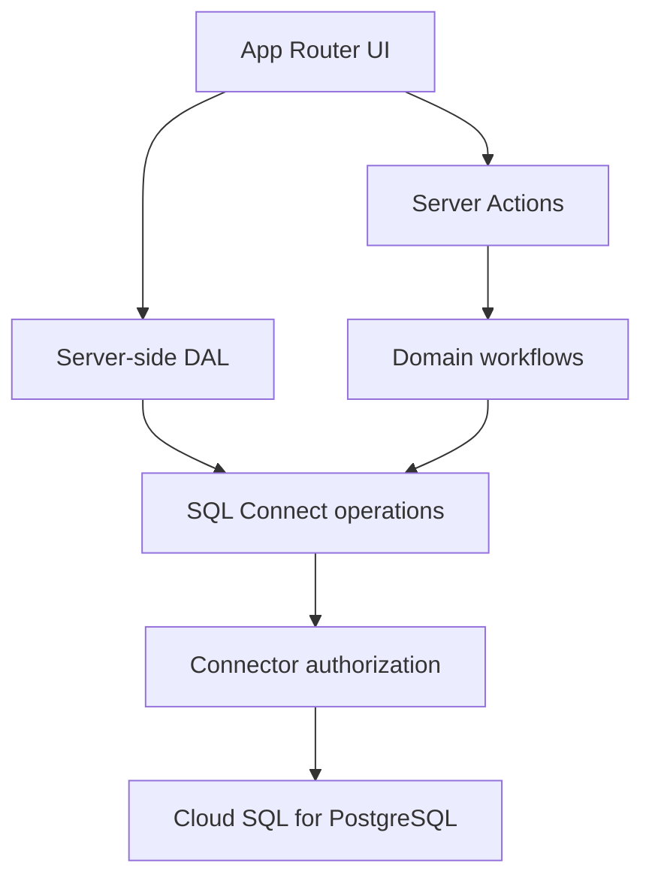

# FUKUSHIMA MACHINAKA LAB

商店主のWISHから、学生のChallengeをつくる。福島市中心市街地の「やりたい・困った」を、学生との小さな共創実験へ変えるWebアプリです。

## MVP Scope

- Public: Landing、LAB説明、Challenge一覧・詳細、プライバシー、利用規約
- Auth: メール＋パスワード登録、メール確認、ログイン、ログアウト
- SHOP OWNER: WISH登録、自分のWISH一覧・詳細
- STUDENT: Challenge閲覧・応募、自分の応募履歴
- ADMIN: WISHレビュー、Challenge作成・公開、応募ステータス管理
- Common: モバイル対応、Loading／Empty／404／Error、SEO、アクセシビリティ

決済、チャット、AI自動マッチング、地図、予約、ポイント、ネイティブアプリは対象外です。

## Tech Stack

- Node.js 22+
- Next.js 16 / React 19 / TypeScript
- Tailwind CSS 4
- Firebase Authentication
- Firebase SQL Connect / Google Cloud SQL for PostgreSQL
- Firebase Admin SDK（サーバー専用）
- Zod / React Server Actions
- Vitest / Playwright
- GitHub Actions / Vercel

## Architecture



主な責務:

- `src/app`: routing、Server Components、Server Actionsの入口
- `src/components`: 表示とフォーム。DBへ直接アクセスしない
- `src/lib/auth`: HttpOnlyセッションCookie、認証・role検証
- `src/lib/firebase`: Admin SDK、Identity Toolkit、SQL Connect呼び出し、DTO変換
- `src/features`: WISH／Challenge／Applicationの業務ルール
- `src/services`: 読み取り用DAL
- `dataconnect/schema`: PostgreSQL schema、外部キー、unique制約、index
- `dataconnect/app-connector`: 認証・認可付きquery／mutation

Admin SDKからSQL Connectを呼ぶ際も利用者をimpersonateし、connectorの`@auth`・`@check`を必ず評価します。管理SDKの権限バイパスを通常リクエストに使用しません。

## Local Setup

```bash
git clone <repository-url>
cd fukushima-machinaka-lab
nvm use
npm install
cp .env.example .env.local
npm run dev
```

Firebase未設定でも、公開ページは明示的なSAMPLEデータを使うプレビューモードで起動します。登録、ログイン、WISH、応募、管理機能にはFirebase接続が必要です。

## Firebase SQL Connect Setup

このリポジトリの既定値:

| Resource | Value |
|---|---|
| Firebase project | `fukushima-machinaka-lab` |
| Region | `asia-northeast1`（東京） |
| Service | `fukushima-machinaka-lab-service` |
| Cloud SQL instance | `fukushima-machinaka-lab-instance` |
| Database | `fukushima-machinaka-lab-database` |
| Connector | `app-connector` |

スキーマとconnectorを検証・反映します。

```bash
npm run sql:compile
npm run sql:deploy
npm run sql:seed
```

`sql:seed`は3件のSAMPLE Challengeをupsertします。実データは含みません。

Firebase AuthenticationではEmail/Passwordを有効にし、本番ドメインをAuthorized domainsへ追加してください。登録後は確認メールを開くまでログインできません。

## First Admin

adminは登録画面から選択できません。対象者が通常ユーザーとして登録しメール確認を終えた後、プロジェクト所有者がGoogle Cloud SQL Studioで対象メールと更新件数を確認し、一度だけ昇格します。

```sql
UPDATE profile
SET role = 'admin', updated_at = CURRENT_TIMESTAMP
WHERE email = '<operator-email>';
```

## Environment Variables

| Key | Exposure | Purpose |
|---|---|---|
| `NEXT_PUBLIC_SITE_URL` | Public | metadata、sitemap、確認メール遷移先 |
| `NEXT_PUBLIC_FIREBASE_PROJECT_ID` | Public | Firebase project ID |
| `NEXT_PUBLIC_FIREBASE_API_KEY` | Public | Identity Toolkit client key |
| `FIREBASE_ADMIN_CLIENT_EMAIL` | Server only | Admin SDK service account |
| `FIREBASE_ADMIN_PRIVATE_KEY` | Server only | Admin SDK private key |
| `E2E_*` | Test only | 認証付きE2E専用アカウント |

`FIREBASE_ADMIN_*`をブラウザ、Git、Issue、ログへ出さないでください。Vercelの暗号化されたEnvironment Variablesで管理します。

## Data Model

| Table | Purpose | Sensitive data |
|---|---|---|
| `profile` | role、表示名、学生所属 | 氏名、メール、所属 |
| `wish` | 商店主の相談原本 | 担当者、メール、住所、自由記述 |
| `challenge` | 運営編集済み公開課題 | 公開可能な情報だけ |
| `application` | 学生応募とKNOT状態 | 応募理由、経験、参加可能期間 |

外部キー、応募の複合unique制約、所有者・状態・作成日時のindexを定義しています。

## Authorization Summary

| Role | Profile | WISH | Challenge | Application |
|---|---|---|---|---|
| public | - | - | publishedのみ | - |
| shop_owner | 自分 | 自分のみ作成・閲覧 | published | - |
| student | 自分 | - | published | 自分のみ作成・閲覧 |
| admin | 自分＋role検証 | 全件管理 | 全件管理 | 全件管理 |

追加の防御:

- 登録時roleを`shop_owner` / `student`にconnectorで限定
- admin確認をServer Actionとconnectorの両方で実施
- WISH所有者・Application学生IDを`auth.uid`からサーバー設定
- 非公開住所・連絡先を公開Challenge queryへ含めない
- Challenge公開とWISH状態更新を単一SQL transactionで実行
- 応募作成前に公開状態、締切、重複をDB側で検証

## GitHub Pages

`main`へのpushで `.github/workflows/nextjs.yml` がGitHub Pagesへ静的プレビューを公開します。サーバー機能を持たないため、公開ページとSAMPLEデータのみが対象です。

```bash
GITHUB_PAGES_BASE_PATH=/fukushima-machinaka-lab npm run build:pages
```

登録／ログイン、WISH相談、応募、管理画面の本番動作はVercel版で提供します。

## Quality Checks

```bash
npm run lint
npm run typecheck
npm test
npm run build
npm run build:pages
npm run test:e2e
npm audit --omit=dev
```

CIは秘密情報を使わないSAMPLEモードでlint、型検査、単体テスト、本番buildを実行します。認証付きE2Eは本番利用者ではなく専用テスト環境・専用アカウントで行ってください。

## Vercel Deployment

1. GitHub repositoryをVercelへImport
2. Framework PresetをNext.js、Node.jsを22.xに設定
3. 上記5つの本番Environment Variablesを設定
4. Firebase AuthenticationのAuthorized domainsへVercel本番ドメインを追加
5. Previewで公開・認証・権限・DB保存を確認
6. Productionへpromote

## Security Notes

- `.env*`は`.gitignore`対象で、`.env.example`だけをcommit
- セッションはHttpOnly、Secure（本番）、SameSite=Lax Cookie
- Server Actionsは公開APIと同様に毎回認証・roleを検証
- 入力はZod、connector authorization、SQL constraintsで多層検証
- Reactの標準escapeを利用し、ユーザーHTMLを描画しない
- 個人情報を含むログやスクリーンショットを公開しない
- 詳細は [SECURITY.md](SECURITY.md) を参照

## Production Checklist

- [ ] SQL Connect schema／connectorを本番へdeploy
- [ ] SAMPLE seedを適用し公開queryを確認
- [ ] Firebase Authのメール送信元、テンプレート、Authorized domainsを確認
- [ ] 最初のadminを昇格し、一般登録でadminになれないことを確認
- [ ] Vercelへ公開値2件・サーバー秘密値2件・本番URLを設定
- [ ] SHOP OWNER → WISH → ADMIN → Challenge → STUDENT → Applicationを通しテスト
- [ ] 権限外アクセス、重複応募、締切後応募、session失効を確認
- [ ] プライバシーポリシー、利用規約、保存期間、削除手順を専門家が確認
- [ ] Mobile実機、キーボード操作、コントラストを確認
- [ ] SQL Connect／Cloud SQLの利用量、エラー、無料トライアル期限を監視

## Roadmap

- Phase 2: LAB進捗管理
- Phase 3: DEMO成果ページ
- Phase 4: LOOP / Alumni
- Phase 5: 複数商店街対応
- Phase 6: 大学・行政・金融機関Dashboard
- Phase 7: Residence / 滞在連携
