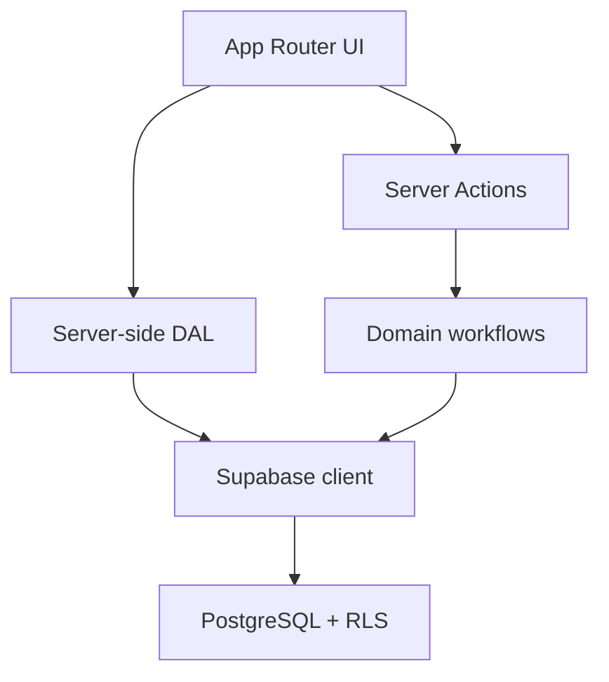

# FUKUSHIMA MACHINAKA LAB

商店主のWISHから、学生のChallengeをつくる。地域の「やりたい・困った」を、学生との小さな実験に変える共創LABの本番MVPです。

初期PoC対象は福島市中心市街地（すずらん通り／パセオ470周辺）。商店主の相談受付から、運営レビュー、Challenge公開、学生応募、運営によるマッチング判断までを一つのWebアプリで扱います。

## Screenshots

本番環境の個人情報を含めず、[docs/screenshots/README.md](docs/screenshots/README.md) の手順で追加してください。

## MVP Scope

- Public: Landing、LAB説明、Challenge一覧・詳細、プライバシー、利用規約
- Auth: メール＋パスワード登録／ログイン、メール確認、ログアウト
- SHOP OWNER: WISH登録、自分のWISH一覧・詳細
- STUDENT: Challenge閲覧・応募、自分の応募履歴
- ADMIN: WISHレビュー・Challenge化・公開状態管理・応募ステータス管理
- 共通: モバイル対応、Loading／Empty／404／Error、SEO、アクセシビリティ

決済、チャット、AI自動マッチング、地図、予約、ポイント、ネイティブアプリは実装していません。

## Tech Stack

- Node.js 22+
- Next.js 16 / React 19 / TypeScript
- Tailwind CSS 4
- Supabase Auth / PostgreSQL / Row Level Security
- Zod / React Server Actions
- Vitest / Playwright
- GitHub Actions / Vercel

## Architecture



主な責務:

- `src/app`: routing、Server Components、Server Actionsの入口
- `src/components`: 表示とフォーム。DBへ直接アクセスしない
- `src/lib/auth`: サーバー側の認証・role検証
- `src/features`: WISH／Challenge／Applicationの業務ルール
- `src/services`: 読み取り用DAL。画面へ必要なDTOだけ返す
- `supabase/migrations`: schema、index、trigger、GRANT、RLSの再現可能な定義

## GitHub Pages（静的プレビュー）

`main` に push すると `.github/workflows/nextjs.yml` が `https://<user>.github.io/<repo>/` へ静的サイトを公開します。
初回のみ GitHub の **Settings → Pages → Build and deployment → Source** を **GitHub Actions** に変更してください。

GitHub Pages はサーバーを持たないため、公開されるのは **SAMPLE データのプレビュー** です。

- 動くもの: Landing、LAB説明、Challenge一覧・詳細、プライバシー、利用規約
- 動かないもの: 登録／ログイン、WISH相談、応募、管理画面（フォーム送信時に案内を表示）

本番のWebApp（Supabase接続あり）は Vercel などのサーバー実行環境へデプロイしてください。

```bash
GITHUB_PAGES_BASE_PATH=/fukushima-machinaka-lab npm run build:pages   # out/ に静的ファイルを生成
```

仕組み: `scripts/build-github-pages.mjs` が静的書き出しと両立しないファイル（`src/proxy.ts`、`auth/callback`、認証必須の動的ページ）を一時退避し、`next.config.ts` の `GITHUB_PAGES=true` 分岐で `output: "export"` と `basePath` を有効化、Server Actions を `src/actions-static/` のダミーへ差し替えてビルドします。

## Local Setup

```bash
git clone <repository-url>
cd fukushima-machinaka-lab
nvm use
npm install
cp .env.example .env.local
```

Supabase未設定でも、公開ページは明示的なSAMPLEデータを使うプレビューモードで起動できます。登録、ログイン、WISH、応募、管理機能にはSupabase接続が必要です。

```bash
npm run dev
```

`http://localhost:3000` を開きます。

## Supabase Setup

### Local Supabase

Docker Desktopを起動後:

```bash
npm run db:start
npm run db:reset
```

`supabase status` が表示するProject URLとPublishable/anon keyを `.env.local` に設定します。`seed.sql` はローカル開発専用です。

### Remote Supabase

新規プロジェクトを作成し、CLIでリンクしてmigrationを適用します。

```bash
npx supabase login
npx supabase link --project-ref <project-ref>
npx supabase db push
```

Auth設定ではSite URLとRedirect URLに次を登録します。

- Local: `http://localhost:3000/auth/callback`
- Production: `https://<your-domain>/auth/callback`

### First admin

adminは登録画面から選択できません。最初に通常ユーザーとして登録・メール確認を完了し、プロジェクト所有者がSQL Editorで一度だけ昇格します。

```sql
update public.profiles
set role = 'admin'
where email = '<operator-email>';
```

対象メールと更新件数を必ず確認してください。以降もadmin付与は運営の管理手続きとして行います。

## Environment Variables

| Key | Required | Purpose |
|---|---:|---|
| `NEXT_PUBLIC_SITE_URL` | Yes | メール確認URL、metadata、sitemapの基準URL |
| `NEXT_PUBLIC_SUPABASE_URL` | Yes | Supabase Project URL |
| `NEXT_PUBLIC_SUPABASE_PUBLISHABLE_KEY` | Yes | ブラウザ利用可能なpublishable key |
| `NEXT_PUBLIC_SUPABASE_ANON_KEY` | Legacy | 旧プロジェクト互換。publishable keyを優先 |
| `E2E_*` | Test only | テスト専用アカウント。GitHub Secretsで管理 |

`SUPABASE_SERVICE_ROLE_KEY` は不要です。ブラウザ、Vercel、GitHubへ登録しないでください。

## Database

| Table | Purpose | Sensitive data |
|---|---|---|
| `profiles` | role、表示名、学生所属 | 氏名、メール、所属 |
| `wishes` | 商店主の相談原本 | 担当者、メール、住所、自由記述 |
| `challenges` | 運営編集済み公開課題 | 公開可能な情報だけ |
| `applications` | 学生応募とKNOT状態 | 応募理由、経験、参加可能期間 |

全テーブルでRLSを有効化し、`owner_id`、`student_id`、status系列にindexを設定しています。

## RLS Summary

| Role | Profiles | WISH | Challenge | Application |
|---|---|---|---|---|
| anon | - | - | publishedのみ | - |
| shop_owner | 自分 | 自分のみ作成・閲覧・編集 | published＋自分のWISH由来 | - |
| student | 自分 | - | publishedのみ | 自分のみ作成・閲覧 |
| admin | 全件閲覧 | 全件管理 | 全件管理 | 全件管理 |

追加の防御:

- 登録時のroleは `shop_owner` / `student` にDB triggerで限定
- role判定にユーザー編集可能な`user_metadata`を使わない
- admin確認はServer ActionとRLSの双方で実施
- 非公開住所・連絡先は`wishes`だけに保存し、公開`challenges`へ自動コピーしない
- Data API権限を明示的にGRANTし、default privilegeをREVOKE

## Seed

`supabase/seed.sql` の3件は `is_sample = true` のDEMOデータです。

```bash
npm run db:reset
```

productionへseedを自動適用しないでください。

## Quality Checks

```bash
npm run lint
npm run typecheck
npm test
npm run build
npm run test:e2e
```

認証付きE2Eには、専用Supabase環境と `.env.example` にある `E2E_*` のテストユーザーが必要です。公開導線のDesktop／Mobile E2EはSAMPLEモードでも実行できます。

## GitHub Actions

`.github/workflows/ci.yml` はpush／Pull Requestごとに次を実行します。

1. `npm ci`
2. `npm run lint`
3. `npm run typecheck`
4. `npm test`
5. `npm run build`

秘密情報を必要としないSAMPLEモードでbuildできるため、fork PRにもsecretを公開しません。

## Vercel Deployment

1. GitHub repositoryをVercelへImport
2. Framework Preset: Next.js、Node.js: 22.x
3. Environment Variablesに3つの`NEXT_PUBLIC_*`をProduction / Preview / Developmentへ設定
4. Supabase AuthのRedirect URLへVercel URLを追加
5. Previewを確認後、Productionへpromote

CLIの場合:

```bash
npx vercel link
npx vercel env pull .env.local
npm run build
npx vercel deploy
npx vercel promote <verified-preview-url>
```

## Security Notes

- `.env*` は `.gitignore` 対象で、`.env.example` だけをcommitします
- Server Actionsは公開APIと同様に毎回認証・role検証します
- 入力はZodとDB constraintsの二段階で検証します
- Supabase clientのparameterized APIを使用し、SQL文字列連結を行いません
- Reactの標準escapeを利用し、ユーザーHTMLを描画しません
- Next.js既定のServer Action origin検証とSameSite auth cookieを利用します
- 詳細は [SECURITY.md](SECURITY.md) を参照してください

## Future Roadmap

- Phase 2: LAB進捗管理
- Phase 3: DEMO成果ページ
- Phase 4: LOOP / Alumni
- Phase 5: 複数商店街対応
- Phase 6: 大学・行政・金融機関Dashboard
- Phase 7: Residence / 滞在連携

## Production Checklist

- [ ] プライバシーポリシー／利用規約を専門家が確認
- [ ] 運営主体、問い合わせ先、保存期間、削除手順を確定
- [ ] Supabase AuthのSMTP、Site URL、Redirect URLを本番設定
- [ ] 最初のadminを昇格し、一般登録でadminになれないことを再確認
- [ ] migration適用後にSupabase Database Advisorsを確認
- [ ] SHOP OWNER → WISH → ADMIN → Challenge → STUDENT → Applicationを実データで通しテスト
- [ ] Mobile実機、キーボード操作、コントラストを確認
- [ ] Vercel Previewを確認後にProductionへpromote

## Status

コード、migration、CI定義はGitHubへpush可能です。本番公開は、別途Supabaseプロジェクト作成・環境変数設定・法務文面確認・実データ通しテストを完了してから行ってください。
